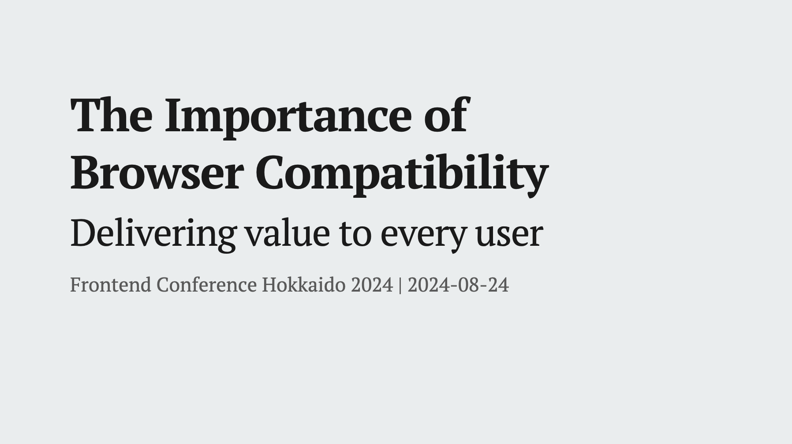

## Overview
In this presentation, we will focus on the importance of considering browser compatibility in front-end development. By looking back at the historical browser wars up to the present day, we will discuss the challenges developers and users face with browsers and the significance of maintaining compatibility.

- We will take a detailed look at how the current major browsers have remained, reflecting on the history of Internet Explorer support.
- We will delve into why adherence to web standards and compatibility is crucial and how a web that lacks it can impact users.
- We will introduce various efforts to maintain browser compatibility and explore ways to contribute to the overall health of the ecosystem.

Developing with an awareness of browser compatibility in front-end development is a responsibility that goes beyond developers—it is essential for safeguarding the future of the web. In this session, we aim to deepen your understanding of browser compatibility and enable you to make informed decisions in your daily development work.

## Translation Articles

[English page](https://yamanoku.net/frontendo-2024/en/) / [日本語ページ](https://yamanoku.net/frontendo-2024/ja/)

## What are the responsibilities of Front-End Development?

The front-end field, which emerged as distinct from back-end development, encompasses a broad range of responsibilities. But what exactly does it mean to be involved in front-end development? Looking at the [Frontend Developer Roadmap](https://roadmap.sh/frontend), it becomes clear that the technical areas front-end developers engage with are vast and varied.

However, I do not believe that mastering all of these areas is necessarily the responsibility of a front-end developer. This is not to suggest that any area should be neglected, but rather that we should focus more on the core essence of front-end development. I believe this core lies in the "areas that surface in the browser".

Websites and web applications are accessed and interacted with through browsers. Therefore, how something is displayed in a browser and how users interact with it are of utmost importance.

One critical aspect to consider when thinking about browser behavior is "**browser compatibility**". Ensuring that a website or web application is displayed consistently across different browsers requires an awareness of browser compatibility. I believe that being mindful of this and implementing it accordingly is one of the key responsibilities of a front-end developer.

In this session, we will deepen our understanding of browser compatibility to help you make sound decisions in your daily development work.

## The History of Browsers and the Current Situation

To understand why browser compatibility is necessary, let's take a look back at the history of browsers themselves.

### The Beginning and Spread of Browsers

The ancestor of what we now call a browser was "**WorldWideWeb**", developed by Tim Berners-Lee. Although it might be confused with the hypertext system, there was a browser specifically designed for viewing the web, and it was the only means to access it.

After that, several browsers emerged, among which "**NCSA Mosaic**" was born. This browser supported multiple operating systems like Mac and UNIX, and its introduction played a significant role in spreading the internet to the general public.

### The First Browser War

Following this, the developers of Mosaic founded a company and released "**Netscape Navigator**", while Microsoft released "**Internet Explorer**" based on Mosaic's code. During this period, "**Opera**", which is still being developed today, also made its debut.

The first browser war began between Netscape Navigator and Internet Explorer. Although Netscape Navigator initially led the browser market, Microsoft gained popularity by bundling Internet Explorer with the Windows OS and introducing proprietary features like ActiveX, which enabled richer content. Eventually, Internet Explorer dominated the market with an overwhelming share.

However, this intense browser war brought about significant differences between browsers, such as "What could be displayed in Internet Explorer could not be displayed in Netscape", which frustrated developers.

### The Second Browser War

Although Netscape Navigator lost the browser war, it later transitioned into the open-source Mozilla project, leading to the creation of "**Mozilla Firefox**", which challenged Internet Explorer. In 2003, Apple introduced "**Safari**", and in 2009, Google launched "**Google Chrome**", which eventually overtook Internet Explorer's market share. The browsers that emerged during this period remain the major browsers used today.

Internet Explorer continued to undergo version upgrades, but the changes were sometimes so drastic that they led to inconsistent displays across different versions. This necessitated the use of CSS hacks to ensure compatibility with specific versions. Some remnants of these adjustments can still be found in long-running web applications.

### The End of Internet Explorer Support

Internet Explorer, which struggled to keep up with web standards, was a notorious challenge for web developers. Known as the need for "IE11 compatibility", it required separate accommodations from other modern browsers. However, on May 19, 2021, Microsoft announced the end of support for Internet Explorer.

The end of Internet Explorer support marked a significant shift, leaving only modern browsers that adhere to web standards. For developers who had long struggled with IE compatibility, this was welcome news.

## The Importance of Browser Compatibility

Having reviewed the history of browsers, let's now discuss the increasing importance of browser compatibility in the current landscape.

### The Browser Landscape After the Demise of Internet Explorer

The rendering engines of the browsers we discussed earlier in this history are as follows:

- *Trident* (Internet Explorer)
- *EdgeHTML* (Old Microsoft Edge)
- *Presto* (Opera)
- *Gecko* (Mozilla Firefox)
  - *Servo*
- *KHTML* (Konqueror)
  - *WebKit* (Safari)
    - *Blink* (Google Chrome)

As of 2024, the following browser engines continue to be actively developed:

- *Gecko* (Mozilla Firefox)
  - *Servo*
- *WebKit* (Safari)
  - *Blink* (Chrome, Current Microsoft Edge)

While there used to be a variety of browser engines, the major browsers in use today are primarily driven by just three engines: Blink, Gecko, and WebKit.

Although new browsers have been released, most are derivatives of Chromium. Despite the increase in browser options, no new browser engines have been introduced.

### What If There Were Only One Browser Engine?

What would happen if the number of browser engines decreased and we were left with only one? It might seem tempting to think that this would simplify support, but this view is overly simplistic.

Mark Nottingham from Cloudflare wrote an [article speculating about a future where Chromium is the only surviving browser engine](https://www.mnot.net/blog/2022/06/22/chromium-only). While the Chromium code might remain open-source, decision-making could become opaque, potentially leading to a situation where only Google’s internal politics shape the web. Additionally, strict government regulations on Google could significantly impact the future of the web.

The progress we've seen, driven by competition, could be replaced by a web shaped solely by Google's vision.

### The Impact of the DMA on the Web

It’s difficult to imagine a world where Chromium and Blink are the only dominant browser engines, but browser engine monopolies are already happening on some commonly used devices. For instance, on iOS, all browsers are built on WebKit, meaning that Chrome on iPhone or iPad is actually powered by WebKit rather than Chromium.

However, recent developments, such as the Digital Markets Act (DMA) in the EU, have prompted changes. Under this regulation, Apple has been asked to allow browsers on iOS to use engines other than WebKit. This means that Chrome will use Blink, and Firefox will use Gecko on iOS. Currently, [the implementation of Blink-based Chrome on iOS is underway](https://blogs.igalia.com/gyuyoung/2024/08/08/chrome-ios-browser-on-blink/).

Although these changes are taking place in the EU, Japan is also considering similar legislation, as seen in the recent cabinet approval of the "Act to Promote Competition Regarding Certain Software Used on Smartphones". This law targets OS, app stores, browsers, and search engines, suggesting that similar changes may occur in Japan.

Given these developments, focusing exclusively on a single browser might lead to the need to reassess previous projects. Therefore, it’s increasingly important to develop with browser compatibility in mind.

## Developer Responsibility and Best Practices

Now that we understand the importance of browser compatibility, let's consider what we as front-end developers should be mindful of and how we can implement best practices.

### Staying Informed About Browser Development

First and foremost, it's crucial to stay informed about the development of various browsers and the release of new features. By regularly checking the release blogs of major companies, you can stay updated on new features and changes.

- [Blog | Chrome for Developers](https://developer.chrome.com/blog)
- [Blog | WebKit](https://webkit.org/blog/)
- [Mozilla Firefox Release Notes](https://www.mozilla.org/en-US/firefox/releases/)

In addition to these, it's also beneficial to keep an eye on "Intents" resources, which provide insights into upcoming specifications and features. These updates are often shared on various social media platforms like X (formerly Twitter), Mastodon, and BlueSky.

While it's ideal to check the sources directly, you can also access this information in Japanese:

- [mozaic.fm](https://mozaic.fm/)
  - Monthly Platform
- Blogs from various companies:
  - [Mitsue-Links Co.,Ltd.](https://www.mitsue.co.jp/knowledge/blog/qc/)
  - [Cybozu Frontend](https://zenn.dev/p/cybozu_frontend)
  - [CodeGrid](https://www.codegrid.net/)

### Understanding Efforts to Maintain Browser Compatibility

Browser compatibility doesn't happen automatically; it requires deliberate efforts. Here are some key initiatives that contribute to this goal.

One significant effort is [Web Platform Tests](https://web-platform-tests.org/), a test suite designed to verify that browser engines adhere to web standards. By running these tests, developers can ensure that the implementation of browser engines is consistent with the established standards.

Another initiative is the [Interop project](https://wpt.fyi/interop). Interop is a collaborative effort involving browser vendors and the free software consultancy Igalia to ensure web standards compatibility. This project started in 2021 and continues to this day.

### Reporting Bugs

When you encounter a bug in a browser engine, it's important to report it. Chrome, Safari, and Firefox all have official bug-tracking systems where you can submit reports. If the issue is with another browser, you can report it via Web compat.

- [https://issues.chromium.org/issues/new](https://issues.chromium.org/issues/new)
- [https://bugs.webkit.org/](https://bugs.webkit.org/)
- [https://bugzilla.mozilla.org/](https://bugzilla.mozilla.org/)
- [https://webcompat.com/](https://webcompat.com/)

While there's no guarantee of an immediate fix, reporting bugs can help reduce the need for developers to implement their own workarounds.

### Participating in Surveys

Participating in surveys like [State of JavaScript](https://stateofjs.com/en-US/), [State of CSS](https://stateofcss.com/en-US/), and [State of HTML](https://stateofhtml.com/en-US/) is also important. These surveys allow you to reassess the current technologies and express your opinions on whether you've used certain tools or are interested in them. Responses from the State of HTML survey, for example, are used by browser vendors and standardization bodies to prioritize implementation roadmaps and close gaps. Therefore, it’s a good idea to participate in these surveys when they become available.

### Understanding Baseline

The final topic to discuss is the concept of [Baseline](https://web.dev/baseline). Baseline refers to a metric that indicates whether a particular web standard feature is supported consistently across multiple browsers.

There are three categories in Baseline:

1. **Widely available**: The feature is consistently supported across multiple browsers and has been for several years.
2. **Newly available**: The feature is stable in the latest versions of browsers but may not work in older versions.
3. **Limited availability**: The feature is experimental and supported by only a few browsers.

You can check Baseline information on MDN Web Docs.

Design consultancy [Clearleft](https://clearleft.com/) uses this Baseline concept when considering [browser support](https://browsersupport.clearleft.com/).

They adopt a policy that allows for visual differences as long as core functionality is not affected. Personally, I believe that instead of merely listing recommended browser versions, it's more beneficial to understand and communicate which features are supported based on functionality.

## The Future of Browsers

Having discussed various efforts surrounding browser compatibility, let’s now touch on the future of browser functionality and what lies ahead.

### Privacy Concerns

A growing area of interest among browser users is privacy. Apple’s Safari includes features like Intelligent Tracking Prevention to protect users from cross-site tracking, while Brave offers Safe Browsing features aimed at enhancing user privacy. However, Firefox recently faced criticism from privacy-conscious users after enabling ad shortcuts on the new tab page by default.

### Integration of Generative AI

Browsers are increasingly integrating generative AI to differentiate themselves. Chrome has introduced Gemini in Chrome DevTools to assist with error resolution, while Safari uses AI to enhance search capabilities. Different AI models are being employed for various use cases, which shows the potential for diverse applications. Personally, I’ve started using Microsoft Edge for reading foreign articles, as its AI tools help with translation and summarization.

### Emergence of New Browsers

While the number of browser engines is decreasing, new browser development is also on the rise. For example, the Servo engine, written in Rust, is being used to develop a new browser called "[**Verso**](https://github.com/versotile-org/verso)". This browser is intended to be integrated into Tauri, a desktop application framework’s WebView. Although still in development, you can download and test it locally.

Another project, "[**Ladybird**](https://ladybird.org/)", is also in progress, aiming to implement its own browser engine and JavaScript engine. An alpha version is expected to be released in 2026, and it will be interesting to see how new browser engines will influence the future of the web.

---

In conclusion, browsers are continuously evolving with unique features and innovations, expanding the choices available to users. I believe in providing accessible browser experiences through these diverse platforms.

Of course, there are limits to what one developer can achieve, so it’s crucial that everyone involved in web development collaborates to maintain compatibility and support the sustainable growth of the web.

Let’s continue to uphold web standards and prioritize browser compatibility in our front-end development efforts.

