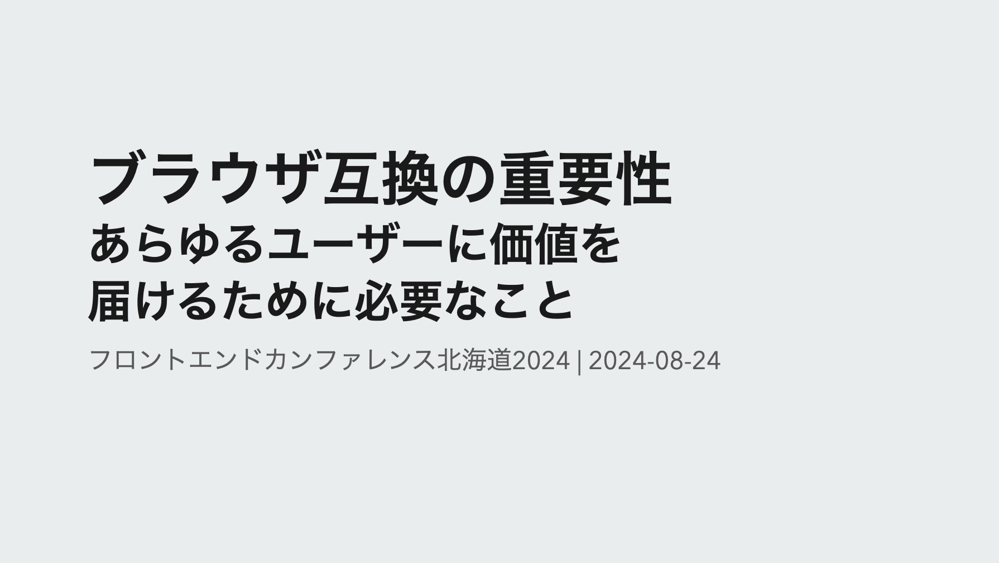

## 概要
本発表では、フロントエンド開発におけるブラウザ互換を意識することの重要性に焦点を当てます。 
過去の歴史的なブラウザ戦争から現代に至るまでを振り返りつつ、開発者やユーザーが直面するブラウザの課題と互換性の重要性を語ります。

- Internet Explorerサポートという歴史を振り返りつつどのようにして現在の主要なブラウザたちが残ったのかを詳しく見ていきます
- Web標準に準拠した互換性がなぜ重要であるか、それが損なわれたWebはどのように影響を与えるかを掘り下げていきます
- ブラウザ互換性を維持するための各種取り組みを紹介し、エコシステム全体の健全性に貢献する方法を模索していきます

ブラウザ互換を意識したフロントエンド開発は、単なる開発者だけの問題を超えるWebの未来を守るための責務です。このセッションで、ブラウザ互換の理解を深め、日々の開発において適切な意思決定ができるようになることを目指します。

## 翻訳記事一覧

[日本語ページ](https://yamanoku.net/frontendo-2024/ja/) / [English page](https://yamanoku.net/frontendo-2024/en/)

## フロントエンドは何が責務なのか

バックエンドと分化して生まれたフロントエンドという領域ですが、フロントエンドに関わる人はどういうことに関わる人のことを指すのでしょうか。[Frontend Developer Roadmap](https://roadmap.sh/frontend)を見ると、フロントエンド開発者が関わる技術領域は非常に広範囲にわたることがわかります。

しかしながら、これらのすべてをできるようになることがフロントエンド開発者の責務だとは私は思いません。それぞれの領域をおろそかにしていいということが言いたいのではなく、より本質たるところに集中すべきなのではないかと思っています。その本質というのはどういう領域なのか、私は「ブラウザで表層する箇所」だと思っています。

WebサイトやWebアプリというものはブラウザという媒体を通じて閲覧・操作できるようになります。そのため、ブラウザでどのように表示されるか、どのように操作されるかということが非常に重要です。

ブラウザの挙動について考えるうえで重要なこととして「**ブラウザ互換**」があります。特定のWebサイトやWebアプリにおいて、どのブラウザでも同じように表示されるようにするためにはブラウザ互換への意識が必要であり、それを意識して実装に臨むことはフロントエンド開発者の責務の1つだとも考えています。

今回はそのブラウザ互換の理解を深めていき、日々の開発において正しい意思決定ができるようになれるような内容を話していきます。

## ブラウザの歴史と今の状況

なぜブラウザ互換が必要なのかを知るために、ブラウザそのものの歴史についてを振り返ってみます。

### ブラウザの始まりと普及

ブラウザと呼ばれる始祖はティム・バーナーズ＝リーが開発した「**WorldWideWeb**」です。ハイパーテキストシステムのものと混同しそうですが、ブラウザとしてのものが存在していました。これがウェブを閲覧する唯一の手段でした。

その後いくつかのブラウザが生まれて、その中で「**NCSA Mosaic**」が誕生しました。MacやUNIXなど複数のOSに対応していたこのブラウザの登場により、インターネットが一般社会に広まるきっかけとなりました。

### 第一次ブラウザ戦争

その後はMosaicの開発者が会社を設立し、「**NetScape Navigator**」がリリースし、MicrosoftはMosaicのコードをベースにして「**Internet Explorer**」をリリースしました。現在も開発が進められている「**Opera**」もこの時期に生まれました。

最初のブラウザ戦争はこのNetScape NavigatorとInternet Explorerとで始まりました。NetScape Navigatorが当時はブラウザとしてリードしていましたが、MicrosoftはWindows OSにInternet Explorerを標準で搭載し、ActiveXといったリッチな表現を可能にする独自実装によって人気を高め、最終的にInternet Explorerが圧倒的なシェアを持つようになりました。

しかしこの壮絶なブラウザ戦争の背後には「Internet Explorerでは表現できていたものが、NetScapeでは表示ができない」というブラウザ間での差異が存在し、開発者を悩ませることになっていました。

### 第二次ブラウザ戦争

ブラウザ戦争に敗れてしまったNetscape Navigatorですが、その後、オープンソースのMozillaプロジェクトへ移行し、「**Mozilla Firefox**」が登場し、Internet Explorerに対抗しました。その後2003年にAppleから「**Safari**」が生まれ、2009年にはGoogleが「**Google Chrome**」をリリースし、かつてあったInternet Explorerのシェアを奪っていきました。この頃に登場してきたブラウザたちは現在でも主要なブラウザとして使われています。

Internet Explorerも徐々にバージョンアップを繰り返していきました。ですが、バージョンの破壊的変更を受けて表示の異なることがありました。そのため特定のバージョンのための表現が必要で、CSSハックをしなければありませんでした。運営が長期になったWebアプリケーションにはその片鱗が残っていることもあります。

### Internet Explorerサポートの終了

そんな標準準拠に追いつけなかったInternet Explorerは、当時のWeb開発者にとっては非常に厄介な存在でした。いわゆる「IE11対応」と呼ばれて他モダンブラウザとは別途対応が必要でした。しかし、2021年5月19日にMicrosoftからInternet Explorerのサポート終了が発表されました。

このInternet Explorerサポート終了により、Web標準に準拠したモダンブラウザたちが残り、IE対応として苦労していた開発者にとっては嬉しいニュースとなりました。

## ブラウザ互換の重要性

ブラウザの歴史を振り返ったところで、次は現在の状況においていかにブラウザ互換が大切になってくるのか、についてを話していきます。

### Internet Explorer亡き後のブラウザ事情

これまで紹介してきた歴史の中で登場してきたブラウザのレンダリングエンジンは以下の通りです。

- *Trident*（Internet Explorer）
  - *EdgeHTML*（旧Microsoft Edge）
- *Presto*（Opera）
- *Gecko*（Mozilla Firefox）
  - *Servo*
- *KHTML*（Konqueror）
  - *WebKit*（Safari）
    - *Blink*（Google Chrome）

ここから2024年現在で開発が続けられているブラウザエンジンは以下の通りです。

- *Gecko*（Mozilla Firefox）
  - *Servo*
- *WebKit* (Safari)
- *Blink* (Chrome, 現Microsoft Edge)

いくつものブラウザエンジンが存在していた時代から、主要なブラウザとして使われるものとしてはBlink、Gecko、WebKitの3つに絞られています。

ここからいくつか新たにブラウザはリリースされているのですがChromiumの派生であるものばかりです。ブラウザの種類は増えていてもブラウザエンジンは新たには生まれていない状況です。

### 仮にブラウザエンジンが1つになったらどうなるのか

仮にもしもブラウザエンジンが減っていき、たった1️つだけになったらどうなるでしょうか。ブラウザエンジンが1つだけになったら、サポートも楽になるのでは？と考えてしまうのは非常に短絡的でしょう。

Cloudflareに所属するマーク・ノッティンガム氏が、[仮にChromiumだけが生き残る世界になる未来を予想した記事](https://www.mnot.net/blog/2022/06/22/chromium-only)を書いています。

今後のChromiumはオープンソースでコード自体は見られるとしてもその意思決定においてまでは不透明なままで、Googleの見えない社内政治に巻き込まれて誰もが参加できなくなる可能性や、政府がGoogleに対して厳格な規制介入が入ることでWeb自体はどうなっていくのだろうかといったことが書かれています。

競争相手が居るからこそ発展できてきたものがGoogleだけが考えるものが、Webの未来になってしまいます。

### DMAの影響を受けるWeb

Chromium、Blinkだけが1つになるということは現実としては想像しづらいでしょうが、実はよく使うデバイスにおいてブラウザエンジンの寡占が行われています。iOSでのブラウザはWebkitベースで実装されており、iPhoneやiPadで使用するChromeはWebkit製です。

ですが最近ではデジタル市場法、通称DMA（Digital Markets Act）という規制がEUで施行され、これによりAppleはSafari以外のブラウザをWebkit以外のブラウザエンジンを実装するような要請がありました。これによりChromeにはBlink、FirefoxにはGeckoで実装されるようになります。現在は[BlinkによるChromeの実装が進められているようです](https://blogs.igalia.com/gyuyoung/2024/08/08/chrome-ios-browser-on-blink/)。

EU圏での話ではありますが、日本でもこのDMAに影響を受けた「スマートフォンにおいて利用される特定ソフトウェアに係る競争の促進に関する法律案」が閣議決定されています。OS、アプリストア、ブラウザ、検索エンジンが対象となっているため、日本においても同様の変更の可能性があります。

ここから考えうることとして、何か特定のブラウザのみに注力していくことはこれまで開発していたものを見直す可能性が高いこととも言えます。ブラウザ互換を意識した開発が重要になってくると考えられます。

## 開発者の責任と実践方法

ブラウザ互換の重要性を知ったうえで、我々フロントエンド開発者がどのようなことに気をつけて実践していくべきかを考えていきます。

### ブラウザ開発の現状を知る

まず各ブラウザでの機能開発や新機能のリリースについての情報を知ることが重要です。各企業のリリースブログをチェックすることで、新機能や変更点を把握できます。

- [Blog | Chrome for Developers](https://developer.chrome.com/blog)
- [Blog | WebKit](https://webkit.org/blog/)
- [Mozilla Firefox Release Notes](https://www.mozilla.org/en-US/firefox/releases/)

次に新たにどういった仕様が追加されるかを知るためにIntentsというリソースを見ることもできます。現在はX（旧Twitter）、Mastodon、BlueSkyの各種SNSにて情報を配信するようになっています。

情報については直接ソースを確認するのが良いですが、日本語からでも情報を知ることができます。

- [mozaic.fm](https://mozaic.fm/)
  - Monthly Platform
- 各社ブログなどでの発信
  - [株式会社ミツエーリンクス](https://www.mitsue.co.jp/knowledge/blog/qc/)
  - [サイボウズフロントエンド](https://zenn.dev/p/cybozu_frontend)
  - [CodeGrid](https://www.codegrid.net/)

### ブラウザ互換を保つ取り組みを知る

ブラウザ互換は何もせずに実現できているわけではありません。具体的にはどのような形で取り組まれているのかを紹介していきます。

まず1つに[Web Platform Tests](https://web-platform-tests.org/)があります。Web Platform TestsはWeb標準に準拠したブラウザエンジンをテストするためのテストスイートです。これにより、ブラウザエンジンの実装がWeb標準に準拠しているかどうかを確認できます。

次に[Interop](https://wpt.fyi/interop)というプロジェクトがあります。InteropはブラウザベンダほかIgaliaというフリーソフトウェアコンサルタント企業が参加するWeb標準の互換性を確保するためのものです。この取り組みは2021年より始まり、今年も継続されています。

### バグを報告する

ブラウザエンジンのバグを見つけた場合は、バグを報告することが重要です。

Chrome、Safari、Firefoxでは公式にバグトラッキングがありその窓口からの報告が可能です。それ以外の場合はWeb compatより報告できます。

- [https://issues.chromium.org/issues/new](https://issues.chromium.org/issues/new)
- [https://bugs.webkit.org/](https://bugs.webkit.org/)
- [https://bugzilla.mozilla.org/](https://bugzilla.mozilla.org/)
- [https://webcompat.com/](https://webcompat.com/)

報告したものが即時対応できるかどうかはわかりませんが、開発者での独自ハックを減らすことに繋げられます。

### サーベイに回答してみる

[State of JavaScript](https://stateofjs.com/ja-JP/)や[State of CSS](https://stateofcss.com/ja-JP/)、[State of HTML](https://stateofhtml.com/ja-JP/)といったサーベイに参加して回答することも重要です。これにより、どのような技術が今あるのかを再認識できるのと、使ったことがある・使ったことがない、興味がある・興味がないというリアクションを示すこともできます。

State of HTMLでの回答では、ブラウザベンダや標準化団体によって実装ロードマップの優先順位付け、ギャップ解消に活用されるとのことなので、サーベイが公開されたら機会を見つけて回答してみるとよいでしょう。

### Baselineを知る

最後に紹介するのが[Baseline](https://web.dev/baseline)です。これはとあるWeb標準の機能がクロスブラウザ対応の安定した実装となっているかを示す指標です。

Baselineには3種類あります。

1. **Widely Available**: クロスブラウザで一貫してサポートされていて何年も前から複数のブラウザーでサポートされている証
2. **Newly available**: 最新版は安定しているが、古いブラウザでは動作しない可能性があるという証
3. **Limited availability**: 実験的機能でまだ一部のブラウザでしか適応されていない証

これはMDN Web Docsで確認できるようになっています。

デザインコンサルティングの[Clearleft社](https://clearleft.com/)では[ブラウザサポート](https://browsersupport.clearleft.com/)をこのBaselineを参考にしています。

コア機能の影響がない範囲で見た目に差異がある場合はそれを許容するというポリシーを持っているようです。個人的にはこのように、ブラウザのバージョンにて推奨環境を提示するよりも機能ベースでどこまでサポートしているかを把握しておいたほうがよいと考えています。

## ブラウザのこれから

以上がブラウザ互換に関する取り組みの一部でしたが、最後にブラウザ自体がもつ機能についてやこれからについてを触れていきます。

ブラウザを使っている中で関心の高まっている部分としてプライバシーがあります。

AppleではSafariでのサイト越えトラッキング防止やBraveのセーフ・ブラウジングなどユーザーのプライバシーを守るための機能をもつブラウザがあります。一方、最近Firefoxでは新しいタブページでの広告ショートカットをデフォルトでONになるような変更があり、一部プライバシーに厳しいユーザーからは批判を受けていました。

ブラウザに生成AIを搭載して差異を出そうとしています。

ChromeではChrome DevToolsにGeminiを使い、エラーの解消などに役立てるようにしていたり、Safariでは生成AIによって検索のサポートをするなどAIモデルもそれぞれ異なって多様な使い方が期待されています。私は海外の記事を読んでる最中に翻訳と要約を生成AIにしてもらうためMicrosoft Edgeを使用するようになりました。

先ほどブラウザエンジンが減っている話をお伝えしましたが、新たなブラウザ作りの動きも生まれてきています。

Rust製のブラウザエンジンであるServoによって「[**Verso**](https://github.com/versotile-org/verso)」というブラウザの開発がされています。これはデスクトップアプリケーションフレームワークであるTauriのWebViewに組み込むことが目的とされています。現在はまだ開発途中ですが手元でダウンロードしてきて試すことができます。

「[**Ladybird**](https://ladybird.org/)」というプロジェクトも始動しており、独自のブラウザエンジンとJavaScriptエンジンを実装していきます。現時点で2年後の2026年にα版がリリースされる予定で実際に試すことになるのはもう少し先になりますが、こうした新たなブラウザエンジンが生まれることでWebの未来がどう変わっていくのか楽しみです。

---

このようにブラウザはそれぞれで異なる機能や特徴を打ち出し、ユーザーへの選択肢を広げていくための努力を続けています。私はそのブラウザたちを通じて誰でもがアクセスできるブラウザ体験を提供していきたいと思っています。

もちろん、いち開発者だけではできる範囲も限られるため、Webに関わる皆が互換性を維持するものに協力していくことも重要だと思います。

Webの持続的な発展が続くよう、Web標準を守りブラウザ互換を意識したフロントエンド開発を続けていきましょう。
